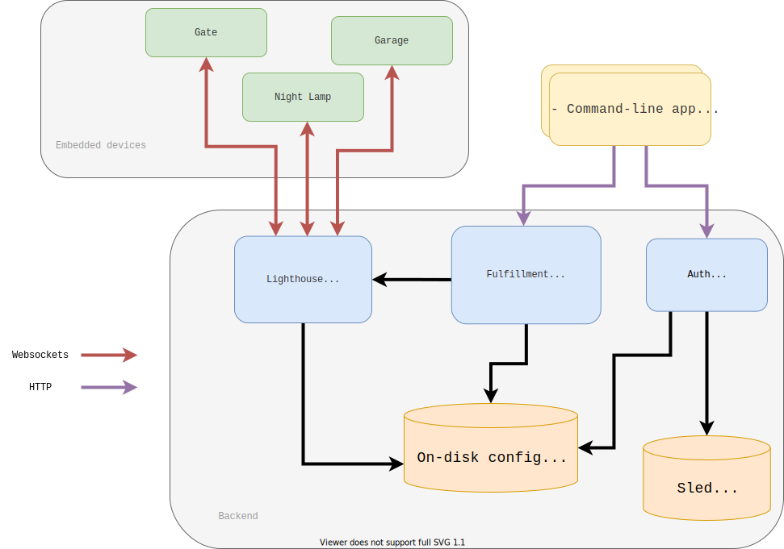

# Houseflow

[](https://github.com/gbaranski/houseflow)

Houseflow is open source home automation system, it lets you configure various accessories like lights, switches, gates, sensors, and much more.

# Features

- [x] Fast, written in high-performance languague, Rust.
- [x] Fully configurable and fully reproducable from config files.

## Supported accessories

- [X] [Xiaomi Mijia HygroThermometer](https://www.xiaomiproducts.nl/en/xiaomi-mijia-bluetooth-thermometer-and-hygrometer.html)
- [ ] ESP8266/ESP32 Support(issue [#161](https://github.com/gbaranski/houseflow/issues/161))

## Supported clients

- [X] iOS Apple Home application. See [HomeKit Accessory Protocol](#homekit-accessory-protocol)
- [ ] Google Home.

# Architecture



# Hub configuration

Hub must be configured, by default it's placed in `$XDG_CONFIG_HOME/houseflow/hub.toml`.

Example configuration

```toml
# Houseflow hub configuration

[hub]
# UUID of the Hub, generate using `uuidgen` command
id = "00000000-0000-0000-0000-000000000000"

# Uncomment to allow outside network accesss
# [network]
# address = "0.0.0.0"

[[accessories]]
id = "1c59f25a-a5b4-4248-810f-01422cee16b0"
name = "super termometr"
room-name = "Bedroom"
manufacturer = "xiaomi-mijia"
model = "hygro-thermometer"
mac-address = "A4:C1:38:EF:77:51"

[providers.mijia]

[controllers.hap]
pin = "11122333"
name = "ExampleHub"

[controllers.meta]
```

## Controllers

Controllers control the accessories from the outside.

#### HomeKit Accessory Protocol

Allows you to integrate Apple Home app with Houseflow Hub.

Example configuration:
```toml
[controllers.hap]
# The `Pin` struct represents the server's 8 digit pin used for pairing.
#
# The pin consists of eight digits between 0 and 9 and defaults to `11122333`.
#
# The following pins are considered too easy and are therefore not allowed:
# - `00000000`
# - `11111111`
# - `22222222`
# - `33333333`
# - `44444444`
# - `55555555`
# - `66666666`
# - `77777777`
# - `88888888`
# - `99999999`
# - `12345678`
# - `87654321`
pin = "11122333"
# Name of the Hub. The name will be visible in the Apple Home app
name = "ExampleHub"
```

To clear caches, remove `~/.local/share/houseflow/hap/` folder.

#### Meta HTTP API

Provides HTTP API for Houseflow Hub communication.
Check [Meta HTTP API Scheme](#meta-http-api-scheme) for more details.

Remember to add `/controllers/meta/` in the URL Path before. For example 
```
GET houseflow_hub.local:5001/controller/meta/characteristic/00000000-0000-0000-0000-000000000000/temperature-sensor/current-temperature
```

Example configuration:
```toml
[controllers.metea]
```

## Providers

Providers provide accessories for the hub.

#### Mijia

Allows Xiaomi Mijia devices to connect

Example configuration:

```toml
[providers.mijia]
```


## Meta HTTP API Scheme

### Read characteristic

#### Request
```
GET /characteristic/:accessory-id/:service-name/:characteristic-name
```

#### Response

```jsonc
{
    "name": :characteristc_name
    // ... values of the characteristic
}
```

#### Example

Reading characteristic with following params:
```
accessory-id: 00000000-0000-0000-0000-000000000000
service-name: temperature-sensor
characteristic-name: current-temperature
```

```http
GET /characteristic/00000000-0000-0000-0000-000000000000/temperature-sensor/current-temperature
```
And if the accessory is connected, and implements the service with the characteristic, it should return
```jsonc
{
    "name": "current-temperature",
    "temperature": 21.89 // or whatever the current temperature is
}
```

### Write characteristic

#### Request
```jsonc
POST /characteristic/:accessory-id/:service-name
Content-Type: application/json
{
    "name": :characteristic-name,
    // ... values of the characteristic
}
```

#### Response

If status is OK, then it returns empty body, otherwise it returns error message in JSON format.

#### Example

Reading characteristic with following params:
```
accessory-id: 00000000-0000-0000-0000-000000000000
service-name: garage-door-opener
characteristic.name: target-door-state
characteristic.open-percent: 80
```

```jsonc
POST /characteristic/00000000-0000-0000-0000-000000000000/garage-door-opener
{
    "name": "target-door-state",
    "open-percent": 80 // or whatever the current temperature is
}
```

# Contributing
Contributors are very welcome! **No contribution is too small and all contributions are valued.**

# Getting help
Get in touch with me on Discord gbaranski#5119, or via email me@gbaranski.com.
