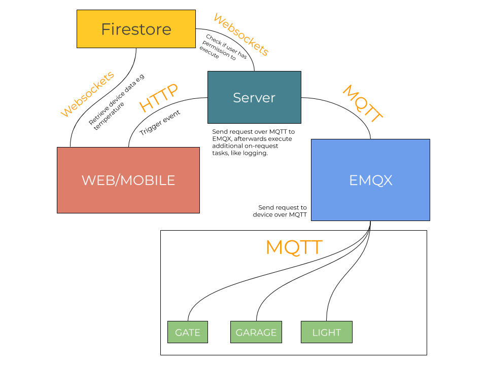

# Houseflow

Houseflow is open source home automation system, it lets you configure various accessories like lights, switches, gates, sensors, and much more.

# Features

- [x] Fast, written in high-performance languague, Rust.
- [x] Fully configurable and fully reproducable from config files.

## Supported accessories

- [X] [Xiaomi Mijia HygroThermometer](https://www.xiaomiproducts.nl/en/xiaomi-mijia-bluetooth-thermometer-and-hygrometer.html)
- [ ] ESP8266/ESP32 Support(issue [#161](https://github.com/gbaranski/houseflow/issues/161))

# Architecture

# Contributing
Contributors are very welcome! **No contribution is too small and all contributions are valued.**

# Getting help
Get in touch with me on Discord gbaranski#5119, or via email me@gbaranski.com.
